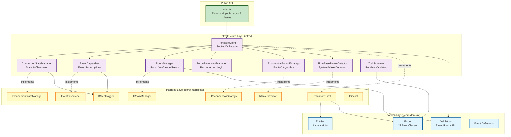
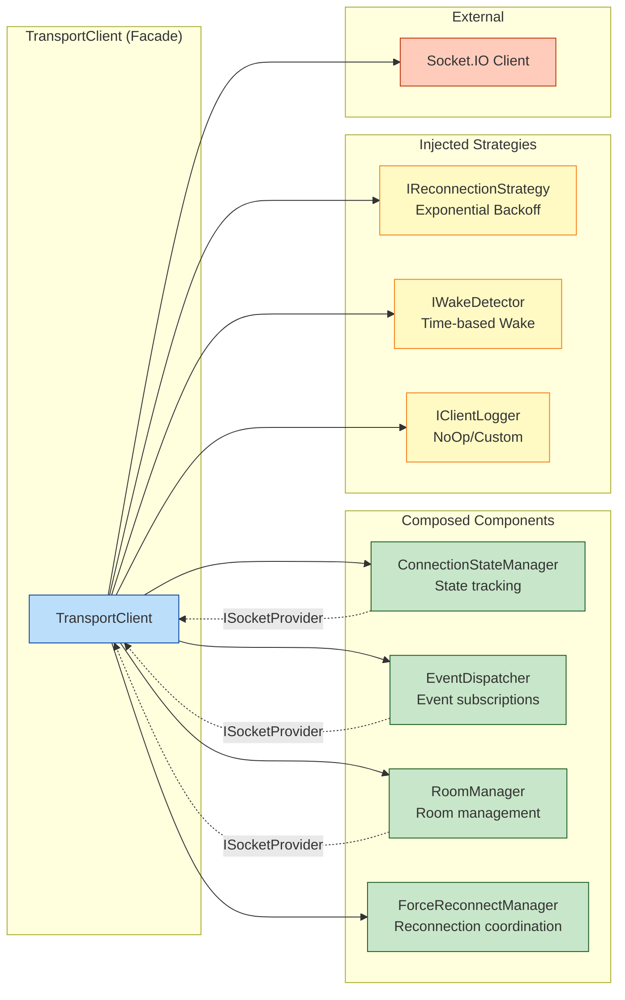
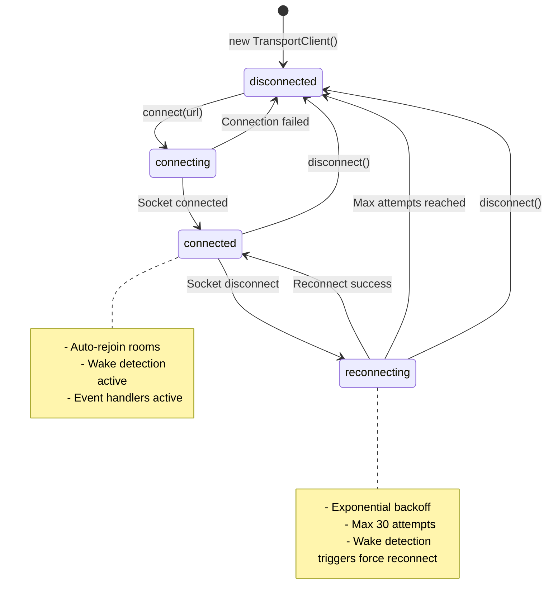

# brv-transport-client Architecture

This document provides a comprehensive overview of the brv-transport-client architecture for developers and AI assistants (like Claude).

## Table of Contents

- [Architecture Overview](#architecture-overview)
- [Layer Architecture](#layer-architecture)
- [Component Diagram](#component-diagram)
- [Design Patterns](#design-patterns)
- [Architecture Decision Records](#architecture-decision-records)

## Architecture Overview

The brv-transport-client is a production-grade TypeScript library implementing a real-time transport client using Socket.IO. It follows **Clean Architecture** principles with strict layer separation and **SOLID** design principles.

### Key Characteristics

- **Clean Architecture**: 3-layer separation (Domain, Interfaces, Infrastructure)
- **Zero Dependency Violations**: Core layer has no external dependencies
- **Type-Safe**: Full TypeScript strict mode with Zod runtime validation
- **Race Condition Mitigation**: Connection ID tracking, promise mutex, AbortController
- **Memory Leak Prevention**: Comprehensive cleanup with max pending handler limits
- **Production Ready**: Comprehensive test suite with domain validators at 1:1 coverage, infrastructure tests ongoing

## Layer Architecture



### Layer Dependency Rules

**CRITICAL**: Dependencies only flow inward (Dependency Inversion Principle)

```
┌─────────────────────────────────────────┐
│  Infrastructure (infra/)                │  ← Concrete implementations
│  - Socket.IO adapters                   │  ← External framework dependencies
│  - Zod schemas                          │  ← Can import from Interfaces & Domain
└────────────────┬────────────────────────┘
                 │ depends on ↓ (via interfaces)
┌─────────────────────────────────────────┐
│  Interfaces (core/interfaces/)          │  ← Port definitions
│  - Contract definitions                 │  ← Type-only imports
│  - No implementation                    │  ← Can import from Domain only
└────────────────┬────────────────────────┘
                 │ depends on ↓
┌─────────────────────────────────────────┐
│  Domain (core/domain/)                  │  ← Business logic
│  - Pure TypeScript                      │  ← ZERO external dependencies
│  - Entities, Errors, Validators         │  ← No imports from outer layers
└─────────────────────────────────────────┘
```

## Component Diagram

### TransportClient Composition



**Key Insights**:
- **Facade Pattern**: TransportClient coordinates 6 specialized components
- **Composition over Inheritance**: No class inheritance, all behavior via composition
- **Dependency Injection**: All dependencies injectable (Open/Closed Principle)
- **Provider Pattern**: Composed components access socket via ISocketProvider (closure-based inversion)

### Connection Lifecycle State Machine



## Design Patterns

### 1. Facade Pattern

**Implementation**: `TransportClient`

**Purpose**: Simplify complex subsystem of 6 components

```typescript
// User sees simple API
const client = new TransportClient()
await client.connect(url)
client.on('event', handler)
await client.joinRoom('room')

// Behind the scenes, coordinates:
// - ConnectionStateManager (state tracking)
// - EventDispatcher (event handling)
// - RoomManager (room management)
// - ForceReconnectManager (reconnection)
// - IReconnectionStrategy (backoff algorithm)
// - IWakeDetector (system wake detection)
```

### 2. Strategy Pattern

**Implementation**: `IReconnectionStrategy`

**Purpose**: Pluggable reconnection algorithms

```typescript
// Default: Exponential backoff
const client1 = new TransportClient()

// Custom: Linear backoff
class LinearBackoff implements IReconnectionStrategy {
  getDelay(attempt: number): number { return 1000 * attempt }
}
const client2 = new TransportClient({
  reconnectionStrategy: new LinearBackoff()
})
```

### 3. Observer Pattern

**Implementation**: `EventDispatcher`, `ConnectionStateManager`

**Purpose**: Multiple subscribers to events and state changes

```typescript
// Multiple handlers for same event
client.on('message', handler1)
client.on('message', handler2)

// State change observers
client.onStateChange((state) => console.log(state))
```

### 4. Factory Pattern

**Implementation**: `TransportClientFactory`, `InstanceInfo.create()`

**Purpose**: Controlled object creation with validation

```typescript
// Factory with discovery logic
const factory = new TransportClientFactory()
const {client, projectRoot} = await factory.connect()

// Entity factory with validation
const info = InstanceInfo.create({pid: 1234, port: 9847})
```

### 5. Null Object Pattern

**Implementation**: `NoOpClientLogger`

**Purpose**: Eliminate null checks for optional logger

```typescript
// Default: No-op logger (no null checks needed)
this.#logger = config.logger ?? new NoOpClientLogger()

// All code can safely call:
this.#logger.debug('message') // Works even if no logger configured
```

### 6. Provider Pattern (Closure-based Inversion)

**Implementation**: `ISocketProvider`

**Purpose**: Read-only access to socket for composed components

```typescript
// TransportClient creates provider via closure
const internalSocketProvider: ISocketProvider = {
  getSocket: () => this.#socket  // Closure captures private field
}

// Components depend on interface, not TransportClient
this.#eventDispatcher = new EventDispatcher({
  socketProvider: internalSocketProvider
})
```

## Architecture Decision Records

### ADR-001: ES2022 Private Fields

**Status**: Accepted

**Context**:
TypeScript offers two privacy mechanisms:
1. TypeScript `private` keyword (compile-time only)
2. ES2022 private fields with `#` (runtime privacy)

**Decision**: Use ES2022 private fields (`#field`) throughout the codebase.

**Rationale**:
- **True Encapsulation**: Cannot be accessed via bracket notation or reflection
- **Runtime Privacy**: Privacy enforced by JavaScript engine, not just compiler
- **Future-Proof**: Native JavaScript feature, not TypeScript-specific
- **Performance**: V8 optimizations for private fields

**Consequences**:
- ✅ Stronger encapsulation guarantees
- ✅ Consistent with modern JavaScript standards
- ⚠️ Slightly less familiar to developers used to `private` keyword
- ⚠️ Cannot be accessed in tests (requires proper interface testing)

**Example**:
```typescript
export class TransportClient {
  // ✅ ES2022 private field (runtime privacy)
  readonly #socket: Socket | undefined

  // ❌ TypeScript private (compile-time only)
  // private socket: Socket | undefined
}
```

---

### ADR-002: Socket.IO vs Native WebSocket

**Status**: Accepted

**Context**:
Need to choose real-time communication protocol for ByteRover Core ↔ CLI communication.

**Options Considered**:
1. Socket.IO (WebSocket with fallbacks)
2. Native WebSocket (standard WebSocket API)
3. Server-Sent Events (SSE)

**Decision**: Use Socket.IO

**Rationale**:
- **Automatic Reconnection**: Built-in reconnection with exponential backoff
- **Room Support**: Native room/namespace support for targeted broadcasts
- **Fallback Transports**: Falls back to long-polling if WebSocket unavailable
- **Event-Based API**: Natural event emitter pattern
- **Binary Support**: Handles both text and binary messages
- **Production-Ready**: Battle-tested in production environments

**Trade-offs**:
- ✅ Rich feature set (rooms, namespaces, acknowledgments)
- ✅ Mature ecosystem with good TypeScript support
- ✅ Automatic connection management
- ⚠️ Larger bundle size (~60KB) vs native WebSocket
- ⚠️ Requires Socket.IO server (can't use generic WebSocket servers)

**Consequences**:
- Must abstract Socket.IO behind `ISocket` interface (enables future replacement)
- Room management becomes first-class feature
- Connection reliability improved via automatic reconnection

---

### ADR-003: Zod for Runtime Validation

**Status**: Accepted

**Context**:
TypeScript provides compile-time type safety but cannot validate runtime data from external sources (Socket.IO events, JSON files).

**Options Considered**:
1. Zod (schema validation with type inference)
2. io-ts (functional approach, similar to Zod)
3. Yup (validation library)
4. Manual validation (hand-written validators)

**Decision**: Use Zod for runtime validation at trust boundaries.

**Rationale**:
- **Type Inference**: `z.infer<typeof Schema>` generates TypeScript types
- **Single Source of Truth**: Schema defines both validation and types
- **Composability**: Can build complex schemas from primitives
- **Error Messages**: Clear, actionable error messages
- **Performance**: Fast validation with minimal overhead

**Placement**:
- Zod schemas in `infra/schemas/` (infrastructure layer)
- Domain validators in `core/domain/validators/` (pure business rules)

**Why Not Domain Layer?**:
- Zod is external dependency (domain must have zero external deps)
- Validation at boundaries (infrastructure responsibility)
- Domain validators handle business rules (event name format, room name rules)

**Example**:
```typescript
// infra/schemas/schemas.ts (runtime validation)
export const TaskCreateRequestSchema = z.object({
  taskId: z.string().uuid(),
  type: TaskTypeSchema,
  content: z.string().min(1),
})

// core/domain/validators/event-name-validator.ts (business rules)
export function validateEventName(event: string): void {
  if (event.length > 255) {
    throw new InvalidEventNameError(event, 'max 255 chars')
  }
}
```

**Consequences**:
- ✅ Runtime safety at trust boundaries
- ✅ Type safety from schema definitions
- ✅ Clear separation: Zod for structure, domain validators for business rules
- ⚠️ Duplication between Zod schemas and domain validators (acceptable trade-off)

---

### ADR-004: Exponential Backoff Reconnection Strategy

**Status**: Accepted

**Context**:
Need reconnection strategy when connection drops. Must balance fast reconnection with server load.

**Options Considered**:
1. Fixed delay (e.g., retry every 1 second)
2. Linear backoff (1s, 2s, 3s, 4s...)
3. Exponential backoff (5s, 10s, 20s, 40s, 80s...)
4. Exponential backoff with jitter (adds randomness)

**Decision**: Exponential backoff with jitter (default strategy).

**Parameters**:
- Initial delay: 5000ms (5 seconds)
- Delays: `[5000, 10000, 20000, 30000, 60000]` ms
- Max attempts: 10 (default, configurable)
- Jitter factor: 50% (adds randomness to prevent thundering herd)

**Rationale**:
- **Conservative Initial Retry**: 5-second first attempt prevents server overload on mass reconnection
- **Gradual Backoff**: Increases delays to reduce server load during prolonged outages
- **Jitter**: 50% randomization prevents synchronized retries from multiple clients (thundering herd)
- **Reasonable Max Delay**: Caps at 60 seconds, appropriate for server-side reconnection scenarios
- **Pluggable**: Strategy pattern allows custom implementations

**Trade-offs**:
- ✅ Balances responsiveness and resource usage
- ✅ Industry standard approach (AWS, Google Cloud use exponential backoff)
- ✅ Configurable via `IReconnectionStrategy` interface
- ⚠️ May be too slow for some use cases (can inject custom strategy)

**Implementation**:
```typescript
export class ExponentialBackoffStrategy implements IReconnectionStrategy {
  readonly #delays = [5000, 10_000, 20_000, 30_000, 60_000] // ms
  readonly #jitterFactor = 0.5

  getDelay(attempt: number): number {
    const delay = this.#delays[Math.min(attempt, this.#delays.length - 1)]
    // Formula: delay * (1 - jitter + random * jitter)
    // With jitter=0.5: delay varies from 0.5*base to 1.0*base
    const jitterMultiplier = 1 - this.#jitterFactor + Math.random() * this.#jitterFactor
    return Math.floor(delay * jitterMultiplier)
  }
}
```

---

### ADR-005: Room Auto-Rejoin on Reconnect

**Status**: Accepted

**Context**:
When connection drops and reconnects, should rooms be automatically rejoined?

**Decision**: YES - automatically rejoin all rooms on reconnect with exponential backoff retry.

**Rationale**:
- **User Expectation**: Users expect room subscriptions to persist across reconnections
- **Stateful Client**: Client maintains room state, simplifies user code
- **Reliability**: Retry with backoff ensures eventual consistency

**Implementation**:
- Track joined rooms in `RoomManager#joinedRooms: Set<string>`
- On reconnect, call `roomManager.rejoinRooms()`
- Retry each room with exponential backoff (5 attempts: 50ms, 100ms, 200ms, 400ms, 800ms)
- Use `AbortController` for clean cancellation
- Deduplication: Skip rooms with active rejoin operation

**Edge Case Handling**:
```typescript
// If leaveRoom() called during rejoin, cancel rejoin
public async leaveRoom(room: string): Promise<void> {
  this.#joinedRooms.delete(room)  // Remove FIRST (prevents infinite rejoin loop)
  this.cancelRejoin(room)          // Cancel pending rejoin
  // ... then emit room:leave
}
```

**Consequences**:
- ✅ Transparent reconnection for room subscriptions
- ✅ No user code needed to handle room rejoins
- ✅ Resilient to transient join failures
- ⚠️ Server must support idempotent room joins

---

### ADR-006: Connection ID for Race Condition Mitigation

**Status**: Accepted

**Context**:
Rapid connect/disconnect cycles can cause race conditions:
- User calls `connect(url1)`, then immediately `connect(url2)`
- Old socket emits `connect` event after new socket created
- State becomes corrupted

**Decision**: Track connection attempts with incrementing ID.

**Implementation**:
```typescript
export class TransportClient {
  #connectionId: number = 0  // Increments on each connect()

  private establishConnection(url: string): Promise<void> {
    return new Promise((resolve, reject) => {
      this.#connectionId++
      const thisConnectionId = this.#connectionId  // Capture current ID

      const onConnect = (): void => {
        if (this.#connectionId !== thisConnectionId) {
          this.log('Connection superseded, ignoring connect event')
          return  // ✅ Detects superseded connection
        }
        // ... proceed with connection
      }
    })
  }
}
```

**Scenario Prevented**:
1. User calls `connect('http://localhost:3000')` → connectionId = 1
2. User calls `connect('http://localhost:4000')` → connectionId = 2
3. First socket emits `connect` → check fails (1 !== 2), event ignored ✅

**Rationale**:
- **Simple**: Single integer check
- **Effective**: Catches all superseded connection events
- **Zero Overhead**: Minimal performance impact

**Consequences**:
- ✅ Prevents state corruption from stale events
- ✅ No need for complex socket cleanup tracking
- ✅ Works with promise mutex for complete protection

---

### ADR-007: Promise Mutex for Concurrent connect() Prevention

**Status**: Accepted

**Context**:
Multiple concurrent `connect()` calls should not create multiple sockets.

**Decision**: Use promise mutex pattern to deduplicate concurrent connect() calls.

**Implementation**:
```typescript
export class TransportClient {
  #connectPromise: Promise<void> | undefined

  public async connect(url: string): Promise<void> {
    // If connection in progress, share the existing promise
    if (this.#connectPromise) {
      if (this.#serverUrl && this.#serverUrl !== url) {
        throw new ConcurrentConnectionError(this.#serverUrl, url)
      }
      return this.#connectPromise  // ✅ Reuse existing promise
    }

    // Start new connection
    this.#connectPromise = this.establishConnection(url).finally(() => {
      this.#connectPromise = undefined  // ✅ Clear mutex
    })

    return this.#connectPromise
  }
}
```

**Scenarios Handled**:
1. **Same URL**: `Promise.all([connect(url), connect(url)])` → both get same promise
2. **Different URL**: `connect(url1)` then `connect(url2)` → throws `ConcurrentConnectionError`
3. **After completion**: Promise cleared, can reconnect

**Consequences**:
- ✅ Prevents duplicate sockets
- ✅ Clear error for conflicting URLs
- ✅ Automatic cleanup via `.finally()`

---

## Key Files Reference

### Critical Implementation Files

| File | LOC | Purpose |
|------|-----|---------|
| [infra/socket-io-client.ts](infra/socket-io-client.ts) | 859 | Main facade, coordinates 6 components |
| [infra/event-dispatcher.ts](infra/event-dispatcher.ts) | 339 | Event subscription & dispatching |
| [infra/room-manager.ts](infra/room-manager.ts) | 383 | Room join/leave/rejoin with retry |
| [core/domain/entities/instance-info.ts](core/domain/entities/instance-info.ts) | 174 | Immutable domain entity |
| [core/interfaces/i-client.ts](core/interfaces/i-client.ts) | 220 | Main public API contract |

### Domain Layer (Pure Business Logic)

```
core/domain/
├── entities/
│   └── instance-info.ts          # Instance data + business rules
├── errors/
│   ├── connection-error.ts       # 6 connection error types
│   └── transport-error.ts        # 16 transport error types
├── validators/
│   ├── common.ts                 # Shared validation logic
│   ├── event-name-validator.ts   # Event name rules
│   ├── room-name-validator.ts    # Room name rules
│   └── url-validator.ts          # URL validation rules
└── types.ts                      # Domain type definitions
```

### Interface Layer (Contracts)

```
core/interfaces/
├── i-client.ts                   # Main API (15 methods)
├── i-connection-state.ts         # State management
├── i-event-dispatcher.ts         # Event handling
├── i-room-manager.ts             # Room operations
├── i-reconnection-strategy.ts    # Reconnection algorithm
├── i-wake-detector.ts            # System wake detection
├── i-client-logger.ts            # Logging abstraction
└── i-socket-provider.ts          # Read-only socket access
```

### Infrastructure Layer (Implementations)

```
infra/
├── socket-io-client.ts           # TransportClient facade
├── connection-state-manager.ts   # State tracking
├── event-dispatcher.ts           # Event subscriptions
├── room-manager.ts               # Room management
├── force-reconnect-manager.ts    # Reconnection coordinator
├── reconnection-strategy.ts      # Exponential backoff
├── wake-detector.ts              # Time-based wake detection
├── no-op-client-logger.ts        # Null object logger
└── schemas/                      # Zod validation schemas
    ├── schemas.ts
    └── types.ts
```

## Development Guidelines

### Adding New Features

1. **Start with Interfaces**: Define contract in `core/interfaces/`
2. **Add Domain Logic**: Business rules in `core/domain/validators/` or entities
3. **Implement Infrastructure**: Concrete implementation in `infra/`
4. **Write Tests**: Unit tests + boundary value tests
5. **Update This Doc**: Add ADR if architectural decision made

### Dependency Rules

**NEVER violate these rules**:
- ❌ Domain imports from Infrastructure
- ❌ Domain imports from Interfaces
- ❌ Domain has external dependencies
- ❌ Interfaces import from Infrastructure
- ✅ Infrastructure imports from Interfaces (via DI)
- ✅ Infrastructure imports from Domain (validators, errors)

### Testing Strategy

See [TESTING.md](TESTING.md) for comprehensive testing documentation.

**Quick Reference**:
- Unit tests: `test/core/domain/`, `test/infra/`
- Integration tests: `test/integration/` (requires `TEST_INTEGRATION=1`)
- Domain validators: Comprehensive coverage with boundary tests
- Infrastructure: Ongoing test expansion for critical paths

## Resources

- [Clean Architecture](https://blog.cleancoder.com/uncle-bob/2012/08/13/the-clean-architecture.html) - Uncle Bob
- [SOLID Principles](https://en.wikipedia.org/wiki/SOLID) - Wikipedia
- [Socket.IO Documentation](https://socket.io/docs/v4/) - Official docs
- [TypeScript Handbook](https://www.typescriptlang.org/docs/handbook/intro.html) - Official guide
- [Zod Documentation](https://zod.dev/) - Schema validation

---

**Last Updated**: 2026-01-28
**Architecture Score**: 9.36/10 (A+) per comprehensive audit
